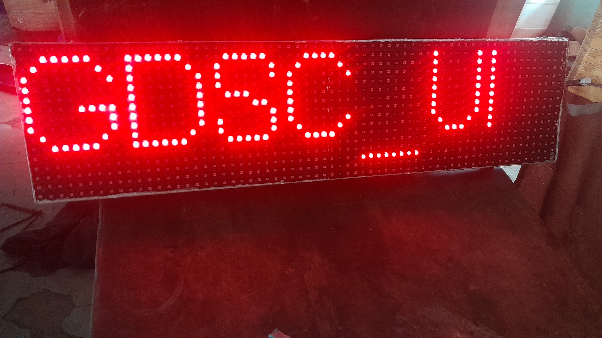
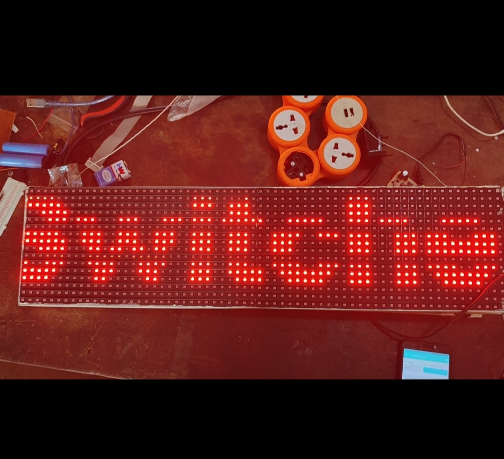

# Programmable Display using Arduino and Flutter

## Description

The Programmable Display project is a customizable display system that utilizes an Arduino Nano as the microcontroller, a P10 DMD display for visual output, and a Bluetooth HC-06 module for receiving commands wirelessly. The system allows users to control the display's content remotely using a mobile app developed with Flutter SDK.

This README provides an overview of the project's features, installation instructions, and usage guidelines.

## Features

- Display custom text and graphics on the P10 DMD display.
- Seamless wireless communication between the display and the mobile app using the Bluetooth HC-06 module.
- User-friendly mobile app interface to send commands and update display content.
- Easy integration with other Arduino projects.

## Technologies Used

- Arduino Nano (Microcontroller)
- P10 DMD Display
- Bluetooth HC-06 Module
- Flutter SDK (for the mobile app)

## Installation

1. Clone the repository from GitHub: https://github.com/thew0205/programmable_display_app.git

2. Upload the Arduino sketch (located in this directory) to the Arduino Nano using the Arduino IDE or any compatible IDE.

3. Install the mobile app on your Android device by following the instructions in the `programmable_display_app/README.md`.

## Usage

1. Power on the Arduino (using 5v) and ensure the Bluetooth HC-06 module is connected and paired with your mobile device.

2. Open the mobile app and establish a connection with the Bluetooth HC-06 module.

3. Use the mobile app's intuitive interface to send text or graphic commands to be displayed on the P10 DMD screen.

4. From the app, you add, insert, change and delete text to be displayed. Also, the font, spacing between letters, scroll direction can be changed.

5. You can also restrict the access to control the display by setting a 4 digit pin.

7. Watch as your custom content comes to life on the display!
